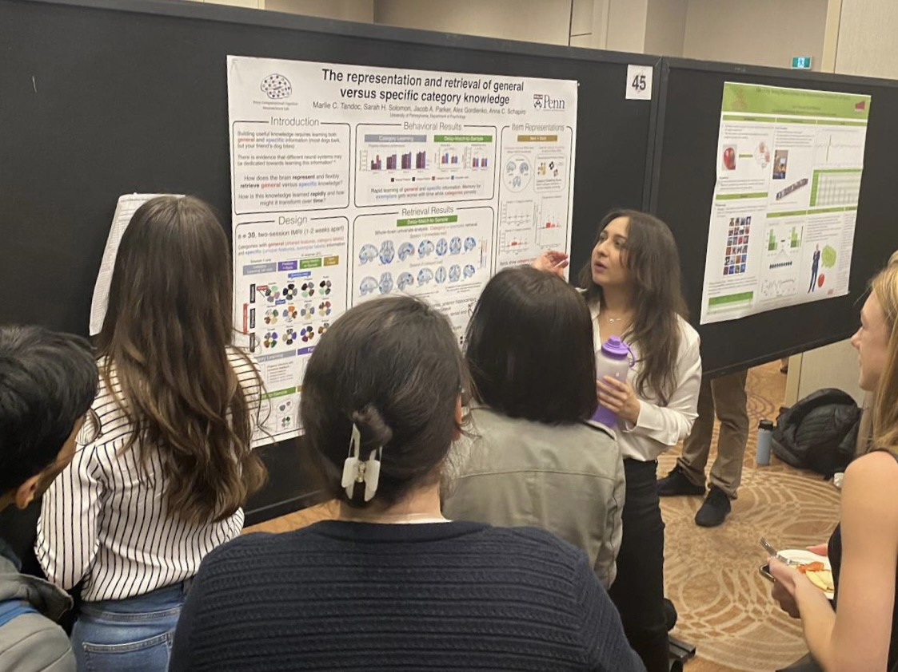

<strong> My Role</strong>: As part of my PhD work I designed and programmed the experiments, helped secure grant funding, created the stimuli, collected online data online, wrangled/analyzed data in R, and developed neuroimaging analysis pipelines.

<strong> Summary</strong>: Information differs in how generalizable or specific it is across experiences. For example, as we encounter birds we can learn that there are shared features that link them together (birds can fly and lay eggs). But we can also learn that there are unique features that set them apart (flamingos are pink and have long legs). We tested whether or not people misremember information differently depending on whether or not it is shared or unique.

In short, to do this, we developed online memory games where participants memorized the colors of cartoon satellite categories. We then tested how people's memory for colors were distorted based on whether or not that satellite part was shared or unique across satellites. We used color because it gives us a tightly-controlled and accessible way to measure how memories are being distorted. We hypothesized that if a part was shared across satellites people might misremember its color as being more similar to the color of the other satellites, a kind of with this blending of colors reflecting a memory error.

In humans, we find that memory biases are strongest for information that is shared across experiences (shared features). In a neural network model trained on the same satellites, we find a strikingly similar effect where the model's internal hidden layer representations are also distorting shared features the most.

This shows that both humans and neural network models—both of which are remarkable at learning patterns—show memory errors that emerge from learning these patterns. This makes sense! <strong> If we learn that certain things in the world are related, in our mind we might represent those things similarly, making it more likely we will mix up the details </strong>. I have recently run research to look at these errors but in human brain by having people play the same memory games, but while lying inside an MRI scanner.

I was fortunate to have the opportunity to present this work as a talk at Neuroscience '22 in San Diego, one of the biggest science conferences in the world.

I also presented a neuroimaging (fMRI) version of this research at an international conference, Cognitive Neuroscience Society, in Toronto, Canada.

