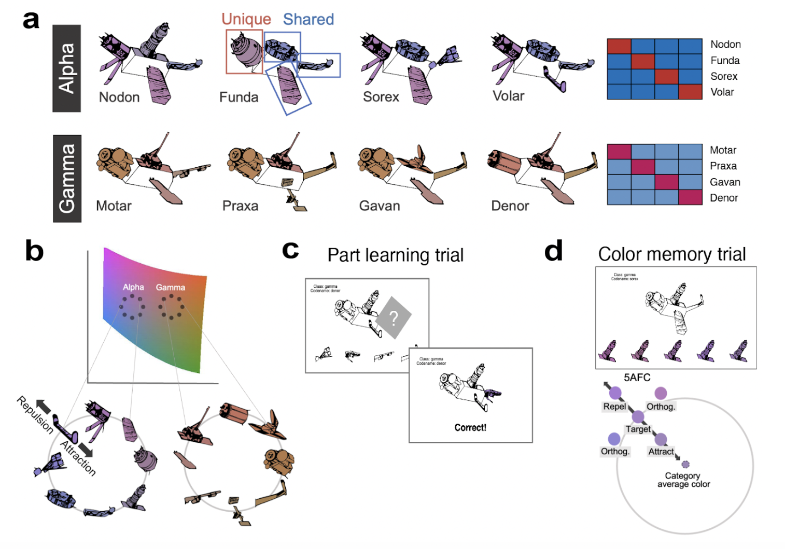
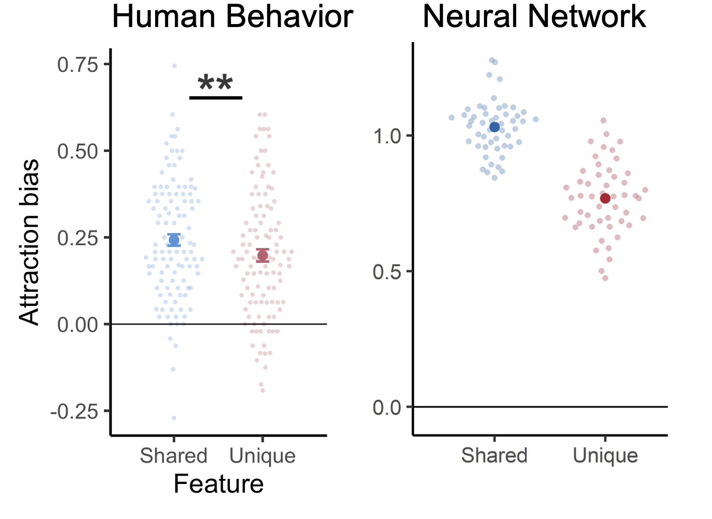
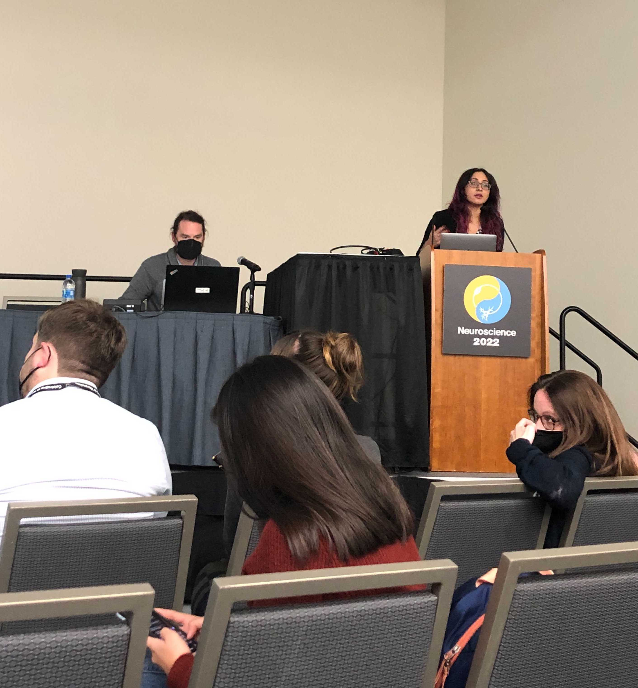

Information differs in how generalizable or specific it is across experiences. For example, as we encounter birds we can learn that there are shared features that link these experiences together (birds can fly and lay eggs). But at the same time, we can also learn that there are unique features that set experiences apart (flamingos are pink and have long legs). We tested whether or not people misremember things differently depending on whether or not it is shared or unique.

In short we created online memory games where participants memorized the colors of cartoon satellite categories. We then tested how people's memory for colors were distorted based on whether or not that satellite part was shared or unique across satellites (like in the bird example above). We used color because it gives us an tightly-controlled and accessible way to measure how memories are being distorted.

We hypothesized that if a part was shared across satellites then you might misremember its color as being more similar to those other satellites, a kind of memory error or false memory. We also trained a biologically-plausible neural network model on the same satellites to see if it would also show this memory error.

In humans, we find that memory biases are strongest for information that is shared across experiences (shared features). In the neural network model, we find a strikingly similar effect where the model's internal hidden layer representations are also distorting shared features the most.

This shows that both humans and neural network models—both of which are remarkable at learning patterns—show memory errors that emerge from learning these patterns.This makes sense! If we learn that certain things in the world are related, in our mind we might represent those things similarily, and thus it is more likely we will mix up the details. We are now collecting neuroimaging data (fMRI) where we will examine how these memory biases manifest from human brain activity. 

<strong> My Role: </strong> As part of my PhD work I led experimental design, programmed the experiments, assisted in securing grant funding, created the stimuli, collected data online, wrangled/analyzed data in R. I also recently presented this work as a talk at Neuroscience '22 in San Diego, one of the biggest science conferences in the world.

