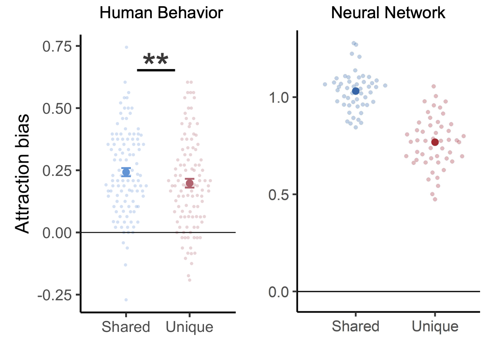

Information varies in how generalizable or specific it is across experiences. For example, as we encounter birds we can learn that there are shared features that link these experiences together (birds can fly and lay eggs). But at the same time, we can also learn that there are unique features that set experiences apart (flamingos are pink and have long legs). We tested whether or not people misremember things differently depending on whether or not it is shared or unique.

To do this, we created online memory games where participants memorized the colors of cartoon satellites. We then tested how people's memory for colors were distorted based on whether or not that satellite part was shared or unique. We also trained a neural network model of the hippocampus on the same satellites to see if it the mode would also show memory biases.
 

In humans, we find that memory biases were the strongest for information that was shared across experiences (shared features). By examining how the hidden layers of a neural network model represent information,  we find a strikingly similar effect where the model's internal representations are also distorting shared features the most.

This shows that both human and machine learners, which are remarkable at learning how information is shared across many experiences, show memory biases that reflect learning of patterns

This makes sense if we learn information across memories are related, it is more likely we will mix up the details. But if we learn that information is idioscynratic (something that ML models need to learn to prevent overfitting). This shows a perhaps negative outcome of an adaptive learning system.

We are now collecting high-resolution neuroimaging data (fMRI) where we will examine how these memory biases manifest from human brain activity. 

<strong> My Role: </strong> I led experimental design, programmed task-based experiments (e.g. memory games) in Javascript and Python, assisted in securing grant funding (>$200k), stimulus creation, develop, wrangled and analyzed data in R, collected data on Amazon Mechanical Turk. I also recently presented this work as a talk at Neuroscience '22 in San Diego, one of the biggest science conferences in the world.

