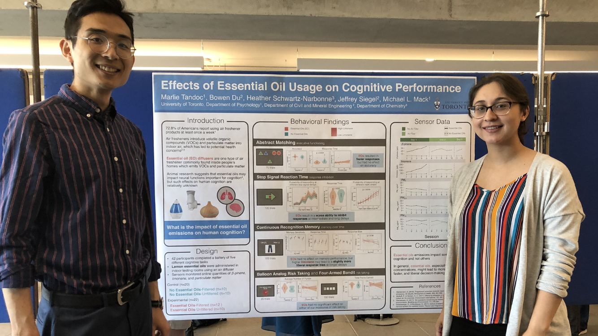

<strong>My Role</strong>: As the psychologist on this project, I developed, programmed, and administered a battery of 6 cognitive tasks to participants that tap into meaningful markers of cognitive performance. I worked closely with engineers and chemists to design tightly controlled experiments and I advised on psychological topics in a literature review. Throughout this project, I worked closely with engineers and advocated for how human/user psychology works.

Poor air quality is related to many health consequences. But usually air quality has been studied outdoors and health consequences emerge across years. Because we spend so much time inside (such as at work), we tested how everyday exposure we have to air pollutants indoors negatively impact cognitive performance in real-time.

With a cross-functional team of engineers, chemists, psychologists, and neuroscientists, we conducted both systematic literature reviews and run in-lab experiments where we can carefully control air quality while participants perform different cognitive tasks. We have found evidence that both CO2 and lemon essential oils (from a diffuser)have detrimental effects on decision-making. Ventilation is thus critical for building design, such as in workplaces, schools, and this is something studied too in high-stakes environment (like submarines and spaceships), as decision-making may otherwise be impaired.

 I also presented earlier versions of this work at a XSEED conference (Toronto, Canada), a conference meant for students to present work that tackles complex, multidisciplinary challenges. 

